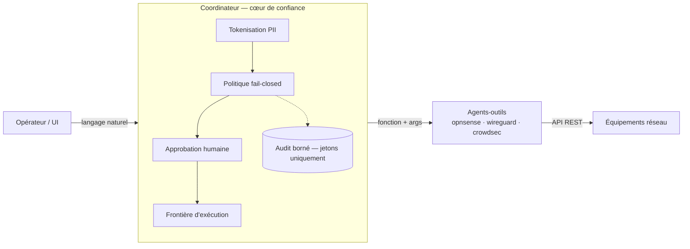
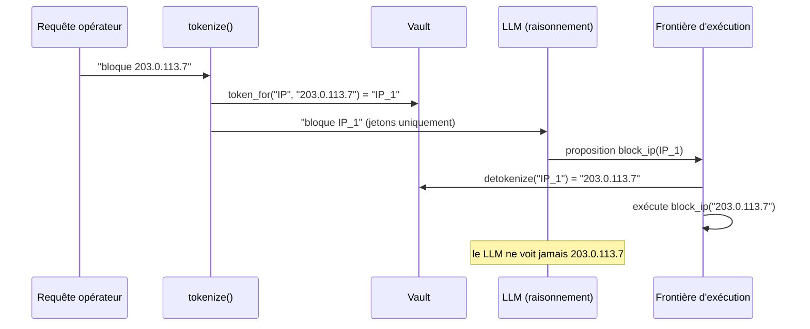
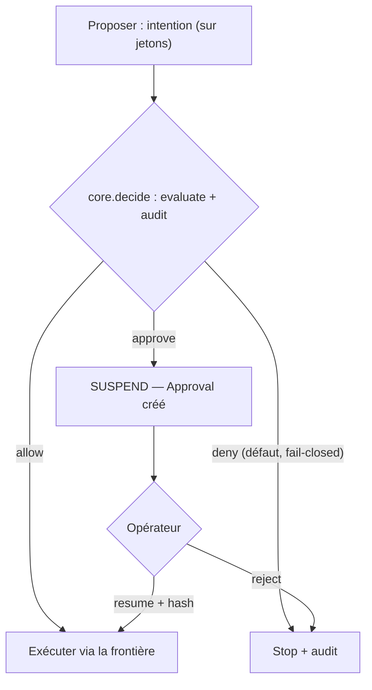
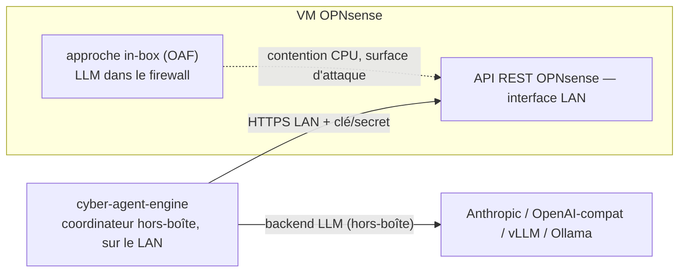
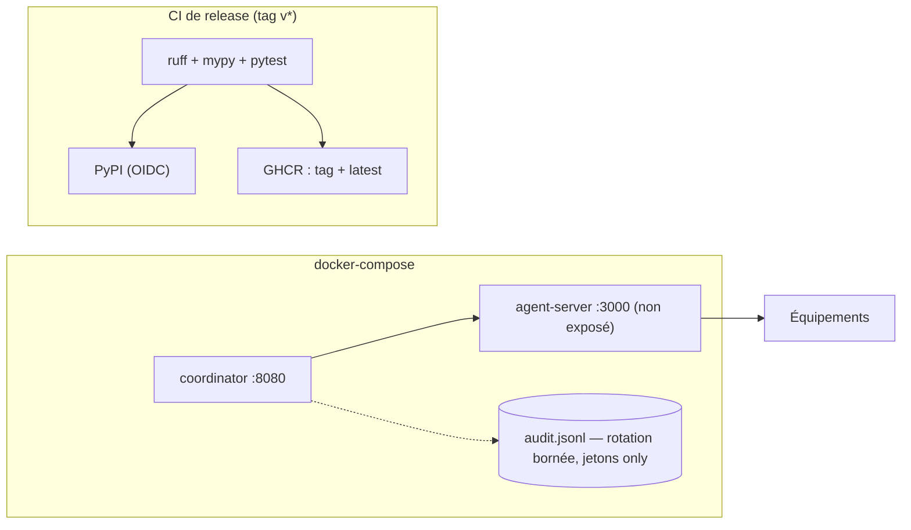
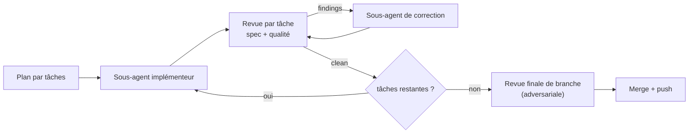

# Vitrine blog cyber-agent-engine — vague FR — Plan de rédaction

> **For agentic workers:** REQUIRED SUB-SKILL: Use superpowers:subagent-driven-development (recommended) or superpowers:executing-plans to implement this plan task-by-task. Steps use checkbox (`- [ ]`) syntax for tracking.

**Goal:** Rédiger les 6 articles FR (en `draft`) de la série vitrine « cyber-agent-engine » sur le blog Hugo nope, exacts vis-à-vis du code et prêts à publier.

**Architecture:** 1 article = 1 tâche = 1 page bundle `content/post/IA/cyber-agent-engine/<N-slug>/index.md` dans le dépôt **blog** (`/srv/__NOPE__/nope.breizhland.eu`). Chaque article : frontmatter figé, plan de section détaillé, extraits de code réels du dépôt public `cyber-agent-engine`, 1 schéma mermaid (fourni ici), liens croisés, + un prompt de bannière. Aucune génération d'image (étape opérateur).

**Tech Stack:** Markdown Hugo (thème chunk, `fr-FR`), mermaid, coloration chroma. Source de vérité factuelle = dépôt public GitHub `cyber-agent-engine` (`/srv/_AI/cyber-agent-engine`, branche `main`).

## Global Constraints

- **Dépôt de travail = blog** `/srv/__NOPE__/nope.breizhland.eu`. Travailler sur une branche dédiée `feat/cae-showcase-fr`. **Ne JAMAIS `git add -A`** : le blog a 6 fichiers modifiés non committés qui ne sont PAS à nous — ne stager QUE le fichier de l'article courant (`git add content/post/IA/cyber-agent-engine/<N-slug>/index.md`).
- **Exactitude** : chaque affirmation technique et chaque extrait de code sont **vérifiés contre `/srv/_AI/cyber-agent-engine`** (chemins, noms de fonctions/classes, signatures) au moment de la rédaction. Citer le code fidèlement ; ne rien inventer ; pas de sur-promesse.
- **Zéro secret** : aucun token/clé/`.env` déchiffré ; exemples avec placeholders (`<clé>`). Avant chaque commit : `grep -rE '(API_KEY|SECRET|-----BEGIN|password)\s*[:=]\s*\S' <fichier>` doit ne rien remonter de réel.
- **Source unique** : contenu tiré du **seul dépôt public GitHub AGPL** ; rien de la factory GitLab privée (entraînement/LoRA internes).
- **Langue** : français, ton technique du blog. `draft: true` sur les 6 (bascule opérateur).
- **Frontmatter figé** (slugs `url:` stables pour les liens EN à venir) ; `series: ["cyber-agent-engine"]`, `series_order` = N ; `mermaid: true` ; `categories: [IA]`.
- **Lien croisé EN** en tête de chaque article : `> 🇬🇧 [English version](/cae-<N>-<slug>-en/) *(à venir)*` — l'URL EN est connue d'avance (slug `cae-<N>-<slug>-en`).
- **Calibrage** : ~1500–2500 mots/article, 1 thèse forte, code réel, 1 mermaid, liens croisés.
- **Bannières** : chaque tâche fournit le **prompt** ; **la génération des PNG est opérateur** (hors périmètre). `title_image` peut rester en placeholder tant que le PNG n'existe pas.
- **Commits** (dépôt blog) : conventionnels, minuscules, sans emoji, sans `Co-Authored-By` ni mention d'IA.

### Charte bannière commune (les 6 — verrouillée)

> Illustration numérique **abstraite**, format large (**ratio ~3.6:1** : générer en 16:9 puis **recadrer**), **AUCUN texte, pas de logo, pas de visage, pas de watermark**. Ambiance sécurité/confiance, sobre et technique. Palette : **bleus profonds + teal**, un **accent ambre**. Lumière cinématique douce, style **géométrique/isométrique abstrait**. Motif récurrent : un **flux de données franchissant une porte / un bouclier**. **Même modèle + même style-prompt + seed fixe** sur les 6 (levier de cohérence de série). PNG rangés dans `static/img/cae/` du blog, câblés via `title_image: "/img/cae/<slug>.png"`.

### Cross-links réels (vérifiés)

- OAF in-box : `/opnsense-llm-in-firewall/`
- Victor / AnonyNER (PII) : `/victor-anonymiseur-logs-securite/`
- Détection réseau IA : `/detection-reseau-ia-dimensionnement/`
- « Agents en Production » : **pas de slug `url:`** → lier vers la **page de série** (`/series/agents-en-production/` ou l'URL réelle du permalink) — **vérifier que le lien résout** avant commit ; à défaut, lier un article précis dont l'URL résout.

### Procédure commune par tâche (remplace le cycle TDD)

Chaque tâche suit : **rédiger** l'`index.md` (frontmatter + corps + mermaid + liens + prompt bannière en commentaire HTML en fin de fichier) → **auto-contrôle** (checklist ci-dessous) → **commit** (fichier unique).

Checklist d'auto-contrôle (obligatoire avant commit) :
1. Chaque extrait de code / nom de symbole existe dans `/srv/_AI/cyber-agent-engine` (le vérifier par `grep`/lecture).
2. `grep` anti-secret sur le fichier : rien de réel.
3. Frontmatter complet et conforme (title, url figé, series/series_order, mermaid:true, draft:true, lien EN).
4. Le bloc mermaid est syntaxiquement clos (` ```mermaid … ``` `).
5. Liens croisés présents et (pour ceux à URL connue) corrects.
6. Longueur ~1500–2500 mots.

---

## Task 1 : Article 1 — « Un LLM avec les droits d'admin sur ton firewall »

**Files:**
- Create: `content/post/IA/cyber-agent-engine/1-llm-firewall-trust-core/index.md` (dépôt blog)

**Frontmatter (exact) :**
```yaml
---
title: "Un LLM avec les droits d'admin sur ton firewall : comment ne pas se faire pwn"
title_image: "/img/cae/1-llm-firewall-trust-core.png"
categories: [IA]
tags: [IA, Sécurité, LLM, DevSecOps, "trust core", firewall]
date: 2026-07-23
mermaid: true
no_toc: false
draft: true
url: "cae-1-llm-firewall-trust-core"
series: ["cyber-agent-engine"]
series_order: 1
---
```
Ligne 1 du corps : `> 🇬🇧 [English version](/cae-1-llm-firewall-trust-core-en/) *(à venir)*`

**Plan de section :**
1. **Accroche (récit)** : donner à un LLM la capacité d'exécuter `block_ip` / `add_filter_rule` sur un pare-feu, c'est puissant *et* terrifiant. Renvoyer à l'expérience in-box (lien `/opnsense-llm-in-firewall/`) : ça marche, mais quatre problèmes crèvent les yeux.
2. **Les 4 dangers concrets** : (a) **injection de prompt** → action destructrice ; (b) **hallucination** d'une règle catastrophique ; (c) **fuite de PII** (IP, hostnames) vers un LLM tiers ; (d) **aucun audit** exploitable.
3. **La thèse** : il ne faut pas un meilleur prompt, il faut une **architecture de confiance** autour du LLM. Présenter les **5 principes** : fail-closed, moindre privilège, humain dans la boucle, jetons-only, auditable.
4. **Vue d'ensemble** : le `core/` du produit (annoncer les articles suivants comme le tour des piliers). Montrer l'arborescence réelle `core/` (`policy/`, `approval/`, `audit/`, `tokens/`, `execution/`, `decision.py`, `orchestrator.py`).
5. **Sortie** : teaser article 2 (« le LLM ne voit que des jetons »).

**Ancres de code (vérifier + citer) :**
- Arborescence `core/` (montrer `ls core/` réel). Optionnel : docstring d'en-tête de `core/policy/engine.py` (« défaut fail-closed », « Le LLM ne voit que… »).

**Mermaid (à insérer tel quel) :**


**Liens croisés :** `/opnsense-llm-in-firewall/` (in-box), « Agents en Production » (série, vérifier l'URL).

**Prompt bannière** (à mettre en commentaire HTML fin de fichier) : *charte commune* + « concept central : un robot/LLM stylisé tend la main vers les interrupteurs d'un pare-feu ; entre eux, un bouclier translucide — tension entre pouvoir et danger. »

- [ ] **Rédiger** `index.md` selon le plan (frontmatter + 5 sections + mermaid + liens + prompt en commentaire).
- [ ] **Auto-contrôle** (checklist commune : exactitude `core/`, anti-secret, frontmatter, mermaid clos, liens, longueur).
- [ ] **Commit** (dépôt blog) :
```bash
git add content/post/IA/cyber-agent-engine/1-llm-firewall-trust-core/index.md
git commit -m "feat(article): série cyber-agent-engine 1/6 — LLM & cœur de confiance (FR, draft)"
```

---

## Task 2 : Article 2 — « Le LLM ne voit que des jetons »

**Files:**
- Create: `content/post/IA/cyber-agent-engine/2-llm-sees-only-tokens/index.md`

**Frontmatter :** identique au gabarit, avec
`title: "Le LLM ne voit que des jetons : tokenisation PII à la frontière d'exécution"`,
`title_image: "/img/cae/2-llm-sees-only-tokens.png"`, `url: "cae-2-llm-sees-only-tokens"`, `series_order: 2`,
tags `[IA, Sécurité, LLM, PII, "data sovereignty", DevSecOps]`.
Ligne 1 : `> 🇬🇧 [English version](/cae-2-llm-sees-only-tokens-en/) *(à venir)*`

**Plan de section :**
1. **L'invariant** : le LLM de raisonnement ne voit **jamais** d'IP/hostname/secret réels — uniquement des **jetons** ; les valeurs réelles ne réapparaissent qu'**à la frontière d'exécution**.
2. **Comment** : `tokenize(text, vault, extract)` remplace les entités par des jetons via un extracteur ; `Vault.token_for(label, value)` mappe valeur→jeton (stable) ; `detokenize(obj, vault)` restitue à l'exécution. L'extracteur regex : `build_regex_extractor()`.
3. **Pourquoi ça compte** : (a) rayon de souffle d'une **injection** réduit (le LLM ne peut pas exfiltrer ce qu'il ne voit pas) ; (b) **souveraineté** : aucune PII vers OpenRouter/Anthropic ; (c) **audit token-only** (transition vers l'article 5).
4. **Filiation** : renvoyer à Victor/AnonyNER (`/victor-anonymiseur-logs-securite/`) — l'anonymisation NER, cousine côté logs.
5. **Limites honnêtes** : l'extracteur regex couvre un jeu d'entités défini ; ce n'est pas de la magie — dire ce qui est couvert.

**Ancres de code (vérifier + citer, extraits courts) :**
- `core/tokens/vault.py` : `class Vault`, `token_for`, `resolve`, `tokenize`, `detokenize`.
- `coordinator/extractor.py` : `build_regex_extractor() -> ExtractFn` (montrer la forme du dict retourné par `_extract`).

**Mermaid :**


**Liens croisés :** `/victor-anonymiseur-logs-securite/`, article 1 (série).

**Prompt bannière** : *charte commune* + « concept : un flux de paquets réseau se transformant en formes-jetons abstraites (des blocs remplacent des adresses) juste avant d'atteindre un cerveau de verre / LLM ; le cerveau ne reçoit que les formes. »

- [ ] **Rédiger** · [ ] **Auto-contrôle** · [ ] **Commit** :
```bash
git add content/post/IA/cyber-agent-engine/2-llm-sees-only-tokens/index.md
git commit -m "feat(article): série cyber-agent-engine 2/6 — le LLM ne voit que des jetons (FR, draft)"
```

---

## Task 3 : Article 3 — « Refuser par défaut »

**Files:**
- Create: `content/post/IA/cyber-agent-engine/3-deny-by-default/index.md`

**Frontmatter :** `title: "Refuser par défaut : politique fail-closed et approbation humaine"`,
`title_image: "/img/cae/3-deny-by-default.png"`, `url: "cae-3-deny-by-default"`, `series_order: 3`,
tags `[IA, Sécurité, "fail-closed", "policy engine", "human-in-the-loop", DevSecOps]`.
Ligne 1 : `> 🇬🇧 [English version](/cae-3-deny-by-default-en/) *(à venir)*`

**Plan de section :**
1. **Fail-closed** : `evaluate(intention, policy)` — comme un firewall, la première règle qui matche gagne ; **aucune règle → `deny`**. Fonction **pure et déterministe**.
2. **Le verdict complet** : `decide(...)` orchestre valider→évaluer→**auditer**→verdict.
3. **La boucle gatée** : `GatedLoop` ; issues `Completed` / `Suspended` / `Denied` / `Failed`. `deny` stoppe ; `approve` **SUSPEND toute la boucle** (session), en attente humaine.
4. **Approbation fail-closed** : `ApprovalStore` — `create` / `approve(id, hash)` / `reject` ; une approbation **jamais résolue n'autorise rien** ; le `hash` d'intention (`intention_hash`) empêche d'approuver une intention et d'en exécuter une autre.
5. **Côté API** : reprise/rejet via `POST /coordinator/resume/{approval_id}` et `/coordinator/reject/{approval_id}` ; `session_ttl` (300 s) borne l'attente.
6. **Ce que ça garantit** : rien ne s'exécute sans verdict explicite ni, pour les actions sensibles, sans un humain.

**Ancres de code (vérifier + citer) :**
- `core/policy/engine.py` : `evaluate(...)` + docstring « Défaut deny (fail-closed) ».
- `core/decision.py` : `decide(...)`.
- `coordinator/loop.py` : `class GatedLoop`, `Completed/Suspended/Denied/Failed`, `session_ttl`.
- `core/approval/store.py` : `ApprovalStore.create/approve/reject`, `intention_hash`.
- `coordinator/app.py` : routes `/coordinator/resume/{approval_id}`, `/coordinator/reject/{approval_id}`.

**Mermaid :**


**Liens croisés :** article 1 (les 5 principes), article 5 (audit).

**Prompt bannière** : *charte commune* + « concept : une vanne/porte **fermée par défaut** ; une main humaine actionne un levier de validation ; symboles allow/deny discrets en flux. »

- [ ] **Rédiger** · [ ] **Auto-contrôle** · [ ] **Commit** :
```bash
git add content/post/IA/cyber-agent-engine/3-deny-by-default/index.md
git commit -m "feat(article): série cyber-agent-engine 3/6 — refuser par défaut (FR, draft)"
```

---

## Task 4 : Article 4 — « Hors de la boîte »

**Files:**
- Create: `content/post/IA/cyber-agent-engine/4-off-box/index.md`

**Frontmatter :** `title: "Hors de la boîte : pourquoi le LLM ne doit pas vivre dans le firewall"`,
`title_image: "/img/cae/4-off-box.png"`, `url: "cae-4-off-box"`, `series_order: 4`,
tags `[IA, Sécurité, OPNsense, "portabilité", "no-GPU", DevSecOps]`.
Ligne 1 : `> 🇬🇧 [English version](/cae-4-off-box-en/) *(à venir)*`

**Plan de section :**
1. **Le contraste** : rappeler l'approche **in-box** (OAF, `/opnsense-llm-in-firewall/`) et ses 4 objections mesurées (surface d'attaque, contention CPU, cycle de vie, audit).
2. **La réponse externe** : le coordinateur vit **hors** de l'équipement → le firewall ne gagne ni surface d'attaque ni charge CPU ; cycle de vie indépendant.
3. **Portabilité** : core **sans GPU** ; backends de raisonnement interchangeables (`anthropic` par défaut, `openai`-compatible, `vllm`, `ollama`) via `COORDINATOR_BACKEND` ; découplage du paquet privé `factory` (imports `clients/`/`agents/` du dépôt).
4. **Cibler un vrai firewall** : l'agent OPNsense est un simple client REST — `OpnsenseAPIClient(base_url, api_key, api_secret, verify_ssl)` en **auth Basic** ; on le pointe sur l'**API LAN** (`OPNSENSE_URL`, `OPNSENSE_VERIFY_SSL=false` pour le cert auto-signé). Renvoyer à la section README « Targeting a real OPNsense (interop) ».
5. **Réserve** : API sur l'**interface LAN uniquement**, jamais WAN ; règle firewall pour l'hôte du coordinateur.

**Ancres de code (vérifier + citer) :**
- `clients/opnsense_api_client.py` : ctor `OpnsenseAPIClient(base_url, api_key, api_secret, verify_ssl)`, `auth=(api_key, api_secret)`.
- `coordinator/llm/` : backends (montrer la liste `anthropic|openai|vllm|ollama`).
- Variables `OPNSENSE_URL` / `OPNSENSE_API_KEY` / `OPNSENSE_API_SECRET` / `OPNSENSE_VERIFY_SSL` (placeholders).

**Mermaid :**


**Liens croisés :** `/opnsense-llm-in-firewall/` (in-box), article 1.

**Prompt bannière** : *charte commune* + « concept : à gauche un LLM **enfermé** dans une boîte-firewall en surchauffe (accent ambre = chaleur/risque) ; à droite un coordinateur **à l'extérieur**, relié par un lien LAN propre et net. »

- [ ] **Rédiger** · [ ] **Auto-contrôle** · [ ] **Commit** :
```bash
git add content/post/IA/cyber-agent-engine/4-off-box/index.md
git commit -m "feat(article): série cyber-agent-engine 4/6 — hors de la boîte (FR, draft)"
```

---

## Task 5 : Article 5 — « Assembler et exploiter en confiance »

**Files:**
- Create: `content/post/IA/cyber-agent-engine/5-assemble-operate-trust/index.md`

**Frontmatter :** `title: "Assembler et exploiter en confiance : audit borné, multi-serveur, packaging, CI"`,
`title_image: "/img/cae/5-assemble-operate-trust.png"`, `url: "cae-5-assemble-operate-trust"`, `series_order: 5`,
tags `[IA, Sécurité, DevSecOps, Docker, "CI/CD", AGPL]`.
Ligne 1 : `> 🇬🇧 [English version](/cae-5-assemble-operate-trust-en/) *(à venir)*`

**Plan de section :**
1. **Assemblage runtime** : `create_default_app()` câble le tout ; `assemble_loop(config, agent_clients, llm)` découvre les agents et **refuse de démarrer** en cas de collision de noms (`AssemblyError`, fail-closed d'assemblage).
2. **Audit borné** : `FileAuditSink(path, *, max_bytes, backup_count)` — rotation par taille (disque borné) ; audit **jetons uniquement** (bouclage avec l'article 2) ; `_RaisingRotatingFileHandler` (fail-closed en écriture).
3. **Multi-serveur** : `AGENT_SERVERS` (CSV, repli `AGENT_SERVER_URL`) ; un agent exposé par 2 serveurs → refus.
4. **Distribution** : Docker/compose (agent-server non exposé, coordinateur :8080, `policy.yml` monté) ; licence **AGPL** ; CI de release (SPDX par fichier, `ruff+mypy+pytest`, tag `v*` → **PyPI OIDC** + **GHCR**).
5. **Garde-fous** : tests AST (SPDX, messages runtime anglais, cohérence surface lint) — la CI empêche la régression.
6. **Résultat** : « déployable par des tiers », sécurité par défaut de bout en bout.

**Ancres de code (vérifier + citer) :**
- `coordinator/app.py` : `create_default_app()`.
- `coordinator/assembly.py` : `assemble_loop(...)`, `AssemblyError`.
- `core/audit/file_sink.py` : `FileAuditSink(...)`, `_RaisingRotatingFileHandler`.
- `docker-compose.yml`, `.github/workflows/ci.yml` + `release.yml` (montrer les gates + jobs).

**Mermaid :**


**Liens croisés :** article 2 (audit jetons-only), article 3 (fail-closed).

**Prompt bannière** : *charte commune* + « concept : des modules/conteneurs isométriques s'emboîtant proprement, un rouleau/journal lumineux (audit) qui les traverse, et un fin pipeline en arrière-plan. »

- [ ] **Rédiger** · [ ] **Auto-contrôle** · [ ] **Commit** :
```bash
git add content/post/IA/cyber-agent-engine/5-assemble-operate-trust/index.md
git commit -m "feat(article): série cyber-agent-engine 5/6 — assembler et exploiter (FR, draft)"
```

---

## Task 6 : Article 6 — « Comment on l'a construit » (méta)

**Files:**
- Create: `content/post/IA/cyber-agent-engine/6-how-it-was-built/index.md`

**Frontmatter :** `title: "Comment on l'a construit : développement piloté par sous-agents et revue adversariale"`,
`title_image: "/img/cae/6-how-it-was-built.png"`, `url: "cae-6-how-it-was-built"`, `series_order: 6`,
tags `[IA, "génie logiciel", "test-first", "code review", DevSecOps]`.
Ligne 1 : `> 🇬🇧 [English version](/cae-6-how-it-was-built-en/) *(à venir)*`

**Plan de section :**
1. **La thèse méta** : la rigueur est un livrable. Le produit a été construit en **sous-projets** (A cœur de confiance → D3 durcissement/CI/i18n), chacun spec → plan → exécution.
2. **La boucle** : un **sous-agent implémenteur** par tâche → **revue par tâche** (conformité au spec + qualité) → **sous-agent de correction** sur les findings → revue finale **adversariale** de branche avant merge.
3. **Test-first & garde-fous** : tests d'enforcement **AST** — en-têtes SPDX (`tests/test_spdx_headers.py`), messages runtime anglais (`tests/test_runtime_messages_english.py`), cohérence de la surface lint (`tests/test_lint_surface_consistency.py`). Ils transforment toute régression en test rouge.
4. **Ce que ça apporte** : contexte frais par tâche, revue systématique, non-régression prouvée — viser une qualité élevée dès le départ plutôt qu'en rattrapage.
5. **Honnêteté** : c'est une méthode, pas une garantie ; dire ses limites (coût en itérations, dépend de la qualité des specs).

**Ancres de code (vérifier + citer) :**
- `tests/test_spdx_headers.py`, `tests/test_runtime_messages_english.py`, `tests/test_lint_surface_consistency.py` (montrer l'idée : scan AST, échec si écart).
- `docs/superpowers/specs/` et `docs/superpowers/plans/` (l'existence de la chaîne spec→plan).

**Mermaid :**


**Liens croisés :** article 1 (ouverture de la série), série « Agents en Production » (vérifier l'URL).

**Prompt bannière** : *charte commune* + « concept : une chaîne de petits agents/robots stylisés se relisant en boucle (flèches de revue circulaires), engrenages fins évoquant la rigueur ; pas de texte. »

- [ ] **Rédiger** · [ ] **Auto-contrôle** · [ ] **Commit** :
```bash
git add content/post/IA/cyber-agent-engine/6-how-it-was-built/index.md
git commit -m "feat(article): série cyber-agent-engine 6/6 — comment on l'a construit (FR, draft)"
```

---

## Auto-revue du plan (checklist auteur)

**Couverture du spec :**
- 6 articles (5 piliers + méta) → Tasks 1-6. ✅
- Angle A + mix (récit en ouverture art.1 + contraste in-box art.4 ; profondeur code partout) ✅
- Frontmatter figé, slugs `url:` stables, lien EN, mermaid par article ✅
- Bannières : charte commune + prompt par tâche, génération opérateur ✅
- Garde-fous : exactitude (checklist + ancres vérifiées), zéro-secret (grep), dépôt public only ✅
- FR d'abord (vague 1) ; EN + lien README = hors périmètre (spec) ✅

**Placeholders :** les mermaid sont fournis intégralement ; les ancres de code pointent des symboles **vérifiés existants** (Vault/tokenize/detokenize, evaluate, decide, GatedLoop+Completed/Suspended/Denied/Failed, ApprovalStore, create_default_app + routes resume/reject, FileAuditSink, assemble_loop/AssemblyError). L'implémenteur cite le code réel (extraits courts) plutôt que de recopier des blocs entiers — approprié pour de la prose, borné par la checklist d'exactitude.

**Cohérence :** slugs `cae-<N>-<slug>` cohérents FR (et EN par suffixe `-en`) ; `series_order` 1→6 continu ; chemins `content/post/IA/cyber-agent-engine/<N-slug>/index.md` uniformes ; commits dépôt **blog** (jamais `git add -A`).

**Piège rappelé :** dépôt blog a 6 fichiers non committés étrangers → `git add <fichier précis>` uniquement.
